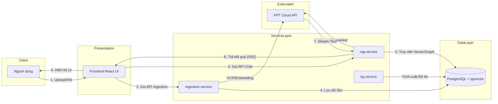
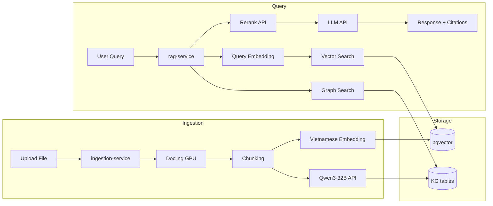
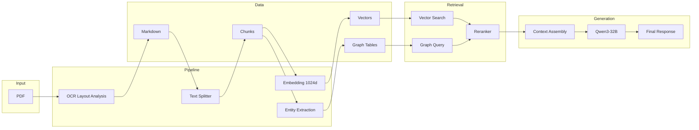
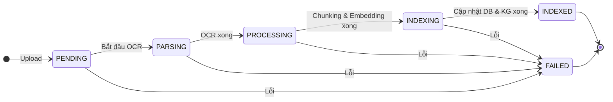
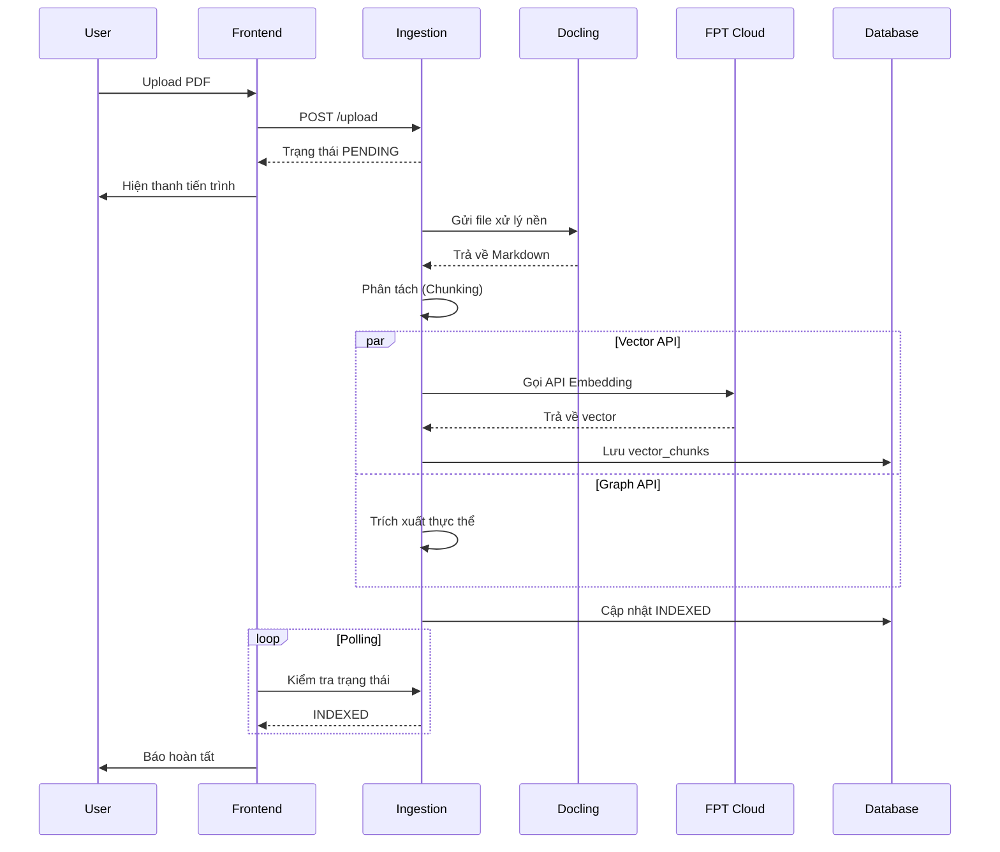
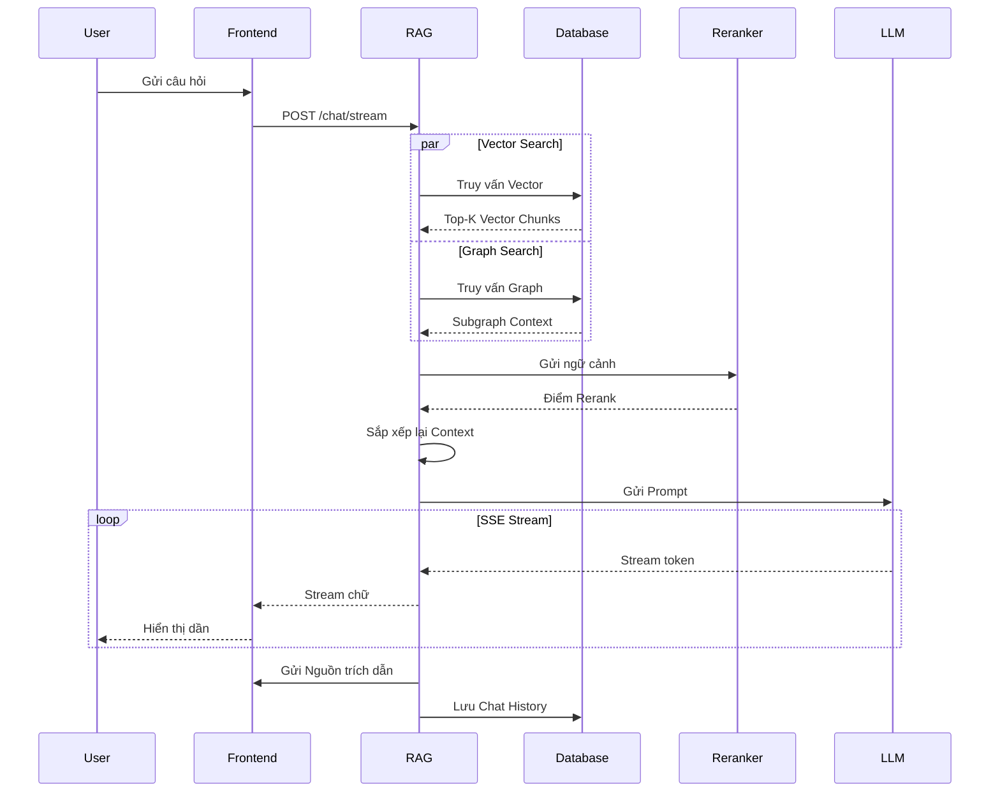
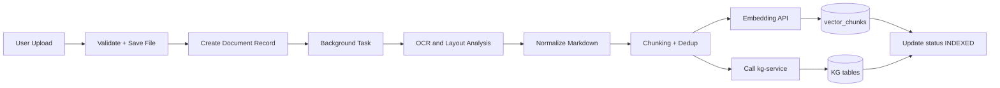
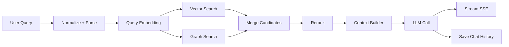
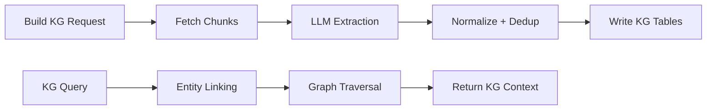
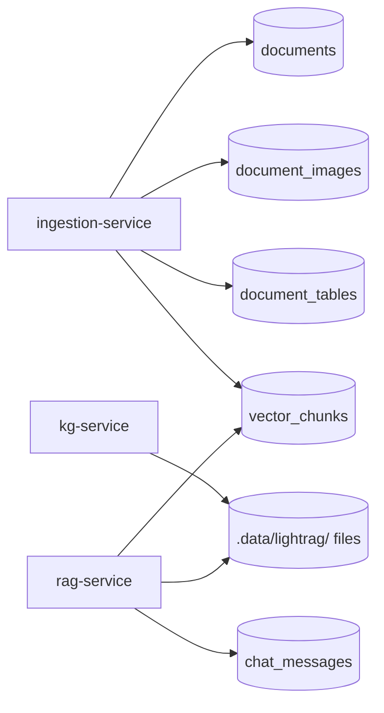

# CUONGRAG DEMO
## Tài Liệu Mô Tả Hệ Thống

## Mục Lục

1. [Tổng Quan Hệ Thống](#1-tong-quan-he-thong)
2. [Kiến Trúc Microservice](#2-kien-truc-microservice)
3. [Thiết Kế Chi Tiết Từng Service](#3-thiet-ke-chi-tiet-tung-service)
4. [Công Nghệ Sử Dụng](#4-cong-nghe-su-dung)
5. [Kế Hoạch Xây Dựng](#5-ke-hoach-xay-dung)
6. [Yêu Cầu Đạt Được](#6-yeu-cau-dat-duoc)
7. [Tiêu Chí Đánh Giá](#7-tieu-chi-danh-gia)
8. [Phương Pháp Đánh Giá](#8-phuong-phap-danh-gia)
9. [Dữ Liệu Demo & Test](#9-du-lieu-demo--test)

---

## 1. Tổng Quan Hệ Thống

### 1.1 Mục tiêu

CuongRAG là nền tảng chatbot RAG hỗ trợ tra cứu tài liệu kỹ thuật. Hệ thống được thiết kế theo mô hình microservices nhẹ, phù hợp chạy local trên máy cá nhân VRAM thấp (API-first cho các mô hình AI).

### 1.2 Đặc điểm chính

- Quản lý workspace độc lập, mỗi workspace có system prompt và cấu hình KG riêng.
- Ingestion tài liệu bất đồng bộ: upload, OCR, chunking, embedding, và index.
- Hybrid retrieval: vector search + KG search + rerank.
- Trả lời có trích dẫn nguồn, streaming SSE.
- Lưu trữ tập trung trên PostgreSQL + pgvector.

### 1.3 Kiến trúc tổng quan

> **Mô tả:** Sơ đồ kiến trúc tổng quan mô tả các lớp của hệ thống. Người dùng tương tác qua Frontend, các truy vấn được chuyển đến Service Layer (RAG, Ingestion, KG). Dữ liệu được lưu trữ tập trung tại PostgreSQL, và các tác vụ AI nặng (Embedding, LLM) được xử lý qua FPT Cloud API theo mô hình API-first.

---

## 2. Kiến Trúc Microservice

### 2.1 Sơ đồ giao tiếp service

> **Mô tả:** Sơ đồ giao tiếp Microservice thể hiện rõ sự tách biệt giữa luồng nhập liệu (Ingestion Flow) chạy ngầm và luồng truy vấn (Query Flow) phục vụ người dùng. Cả hai luồng hội tụ tại lớp lưu trữ Data Layer.

### 2.2 Sơ đồ luồng dữ liệu

> **Mô tả:** Sơ đồ luồng dữ liệu (Data Flow) chỉ ra quá trình biến đổi dữ liệu từ dạng file PDF thô sơ ban đầu, qua các bước số hóa (OCR, Chunking, Embedding) thành vector và đồ thị. Sau đó dữ liệu được truy xuất lai (Hybrid) và qua LLM để sinh ra câu trả lời cuối cùng.

### 2.3 State machine xử lý tài liệu

> **Mô tả:** Sơ đồ trạng thái (State Machine) của quá trình xử lý tài liệu. Mỗi file khi upload sẽ đi qua 5 trạng thái: PENDING (Chờ), PARSING (Đang OCR), PROCESSING (Chunking & Embedding), INDEXING (Đang lưu DB) và cuối cùng là INDEXED (Sẵn sàng phục vụ truy vấn).

### 2.4 Sơ đồ trình tự (Sequence Diagrams)

**2.4.1 Luồng xử lý và số hóa tài liệu (Ingestion)**

> **Mô tả:** Sơ đồ trình tự (Sequence Diagram) luồng Ingestion. Khi Frontend gửi file, Ingestion Service nhận phản hồi ngay để tránh timeout, sau đó tiến hành chạy nền các tác vụ OCR và Vector hóa. Frontend sẽ liên tục Polling để cập nhật tiến trình.

**2.4.2 Luồng hỏi đáp và sinh văn bản (RAG & Chat)**

> **Mô tả:** Sơ đồ trình tự (Sequence Diagram) luồng Chat. Điểm nhấn của luồng là việc tìm kiếm song song (Parallel) Vector và Graph, sau đó sử dụng Reranker để chấm điểm lại. Kết quả sinh từ LLM được truyền thời gian thực về Frontend qua kết nối Server-Sent Events (SSE).

---

## 3. Thiết Kế Chi Tiết Từng Service

### 3.1 Ingestion Service (:8082)

**Chức năng chính**
- Upload tài liệu, validate file, lưu vào uploads/.
- OCR + layout analysis, chuyển đổi sang Markdown.
- Chunking, embedding, dedup, lưu vector.
- Quản lý trạng thái xử lý (PENDING -> INDEXED).

**Luồng logic hoạt động**
1. Nhận file upload, kiểm tra định dạng/kích thước, lưu vào `uploads/`.
2. Tạo bản ghi `documents` với trạng thái `PENDING`.
3. Kích hoạt background task để OCR + layout analysis bằng Docling / MinerU (chạy local trên GPU).
4. Chuẩn hóa Markdown, trích ảnh/bảng, cập nhật `PARSING`.
5. Chunking + dedup, gọi embedding API, lưu vào `vector_chunks`, cập nhật `INDEXING`.
6. Gọi `kg-service` trích xuất entity/relationship (nếu bật KG).
7. Hoàn tất, cập nhật `INDEXED` hoặc `FAILED` nếu lỗi/timeout.

**Sơ đồ luồng**

**API Endpoints**

*Router `/ingest` — upload & xử lý tài liệu:*

| Method | Path | Mô tả |
|--------|------|------|
| POST | /api/v1/ingest/upload/{workspace_id} | Upload và kích hoạt xử lý tài liệu |
| POST | /api/v1/ingest/easy-index | Upload đơn giản (tự tạo workspace) |
| POST | /api/v1/ingest/process/{document_id} | Kích hoạt xử lý lại 1 tài liệu |
| POST | /api/v1/ingest/batch | Xử lý hàng loạt |
| GET | /api/v1/ingest/status/{document_id} | Trạng thái xử lý tài liệu |
| POST | /api/v1/ingest/reindex/{document_id} | Reindex tài liệu |
| DELETE | /api/v1/ingest/document/{document_id} | Xóa tài liệu |

*Router `/documents` — truy vấn metadata tài liệu:*

| Method | Path | Mô tả |
|--------|------|------|
| GET | /api/v1/documents/workspace/{workspace_id} | Danh sách tài liệu theo workspace |
| POST | /api/v1/documents/upload/{workspace_id} | Upload (chưa xử lý ngay) |
| GET | /api/v1/documents/{document_id} | Chi tiết tài liệu |
| GET | /api/v1/documents/{document_id}/markdown | Nội dung Markdown |
| GET | /api/v1/documents/{document_id}/ocr-structured | Dữ liệu OCR có cấu trúc |
| GET | /api/v1/documents/{document_id}/images | Danh sách ảnh |
| DELETE | /api/v1/documents/{document_id} | Xóa tài liệu |

---

### 3.2 RAG Service (:8081)

**Chức năng chính**
- Nhận câu hỏi, sinh query embedding.
- Vector search + KG search + rerank.
- Build prompt, gọi LLM, trả kết quả stream.
- Quản lý workspace, lịch sử chat, citations.

**Luồng logic hoạt động**
1. Nhận câu hỏi từ UI, chuẩn hóa input và ngôn ngữ.
2. Sinh embedding cho query qua API.
3. Truy vấn vector search (pgvector) và graph search (KG tables).
4. Hợp nhất kết quả, rerank bằng bge-reranker-v2-m3.
5. Build context (chunks + KG + ảnh/bảng) và prompt.
6. Gọi LLM, stream token về UI qua SSE.
7. Lưu chat history + sources vào DB.

**Sơ đồ luồng**

**API Endpoints chính**

*Chat & Query:*

| Method | Path | Mô tả |
|--------|------|------|
| POST | /api/v1/rag/chat/{workspace_id} | Chat không stream |
| POST | /api/v1/rag/chat/{workspace_id}/stream | Chat streaming SSE |
| POST | /api/v1/rag/query/{workspace_id} | RAG query (không lưu history) |
| GET | /api/v1/rag/chat/{workspace_id}/history | Lịch sử chat |
| DELETE | /api/v1/rag/chat/{workspace_id}/history | Xóa lịch sử |
| POST | /api/v1/rag/chat/{workspace_id}/rate | Đánh giá câu trả lời |
| GET | /api/v1/rag/capabilities | Thông tin LLM hiện tại |
| POST | /api/v1/rag/debug-chat/{workspace_id} | Debug chat (xem context) |

*Ingestion & Index (qua RAG service):*

| Method | Path | Mô tả |
|--------|------|------|
| POST | /api/v1/rag/process/{document_id} | Xử lý tài liệu |
| POST | /api/v1/rag/process-batch | Xử lý hàng loạt |
| POST | /api/v1/rag/reindex/{document_id} | Reindex tài liệu |
| POST | /api/v1/rag/reindex-workspace/{workspace_id} | Reindex toàn workspace |

*Thống kê & KG (proxy từ RAG service):*

| Method | Path | Mô tả |
|--------|------|------|
| GET | /api/v1/rag/stats/{workspace_id} | Thống kê RAG |
| GET | /api/v1/rag/chunks/{document_id} | Danh sách vector chunks |
| GET | /api/v1/rag/entities/{workspace_id} | Entities KG |
| GET | /api/v1/rag/relationships/{workspace_id} | Relationships KG |
| GET | /api/v1/rag/graph/{workspace_id} | Dữ liệu đồ thị KG |
| GET | /api/v1/rag/analytics/{workspace_id} | Thống kê KG |

*Workspace:*

| Method | Path | Mô tả |
|--------|------|------|
| CRUD | /api/v1/workspaces | Quản lý workspace |
| GET | /api/v1/workspaces/summary | Tóm tắt tất cả workspace |

---

### 3.3 KG Service (:8083)

**Chức năng chính**
- Trích xuất entity và quan hệ từ văn bản.
- Build/rebuild KG, query KG theo workspace.
- Xuất thống kê và dữ liệu đồ thị.

**Luồng logic hoạt động**
1. Nhận yêu cầu build/rebuild KG theo workspace.
2. Lấy Markdown/chunks từ DB, chuẩn hóa nội dung.
3. Gọi LLM (API-first) để trích xuất entity/relationship.
4. Chuẩn hóa schema, loại trùng lặp, ghi vào KG tables.
5. Khi query: nhận câu hỏi, entity linking, mở rộng ngữ cảnh local/global.
6. Trả về subgraph + thống kê cho rag-service/UI.

**Sơ đồ luồng**

**API Endpoints**
| Method | Path | Mô tả |
|--------|------|------|
| POST | /api/v1/kg/build/{workspace_id} | Xây dựng / rebuild KG |
| GET | /api/v1/kg/entities/{workspace_id} | Danh sách thực thể |
| GET | /api/v1/kg/relationships/{workspace_id} | Danh sách quan hệ |
| GET | /api/v1/kg/graph/{workspace_id} | Dữ liệu đồ thị |
| GET | /api/v1/kg/analytics/{workspace_id} | Thống kê KG |

---

### 3.4 Frontend (Vite + React)

**Chức năng chính**
- Upload tài liệu, theo dõi trạng thái xử lý.
- Chat và hiển thị citations, hình ảnh, bảng biểu.
- Quản lý workspace và lịch sử chat.

**Luồng logic hoạt động**
1. Người dùng tạo workspace, cấu hình system prompt và KG.
2. Upload tài liệu, UI gọi ingestion-service và hiển thị tiến trình.
3. UI polling trạng thái đến khi `INDEXED`.
4. Người dùng chat, UI nhận stream SSE và render theo thời gian thực.
5. Hiển thị citations, ảnh/bảng, và lịch sử hội thoại theo workspace.

---

### 3.5 Data Layer (PostgreSQL + pgvector)

**Thành phần**
- Metadata: bảng `knowledge_bases` (workspace), `documents`, `document_images`, `document_tables`, `chat_messages`.
- Vector storage: bảng `vector_chunks` (embedding 1024d, tạo động qua pgvector extension).
- KG storage: **file-based** dùng LightRAG (NetworkX graph + NanoVectorDB), lưu tại `.data/lightrag/{workspace_id}/` — không dùng bảng PostgreSQL.
- Local File Storage: Toàn bộ artifacts lưu tại `.data/` trên máy host (`.data/uploads/`, `.data/output/`, `.data/docling/`, `.data/lightrag/`).

**Luồng đọc/ghi chính**
- Ingestion ghi `documents`, `document_images`, `document_tables`, `vector_chunks`.
- KG service ghi file LightRAG vào `.data/lightrag/{workspace_id}/`.
- RAG service đọc `vector_chunks`, gọi KG service để lấy context đồ thị, và ghi `chat_messages`.

**Sơ đồ luồng**

---

## 4. Công Nghệ Sử Dụng

### 4.1 Backend

| Layer | Technology | Purpose |
|------|------------|---------|
| Runtime | Python 3.11 | Backend language |
| Framework | FastAPI | REST API + async |
| ASGI | Uvicorn | HTTP server |
| ORM | SQLAlchemy 2.0 (async) | DB mapping |
| Validation | Pydantic v2 | Schema validation |

### 4.2 AI/ML (API-first)

| Component | Technology | Provider | Purpose |
|----------|-----------|----------|---------|
| OCR Engine | Docling / MinerU | Local Container (GPU) | PDF -> Markdown, trích xuất bảng/ảnh |
| Vision Captioning | Qwen2.5-VL-7B-Instruct | FPT Cloud API | Mô tả ảnh/bảng |
| Embedding | Vietnamese Embedding (1024d) | FPT Cloud API | Text -> vector |
| Reranker | bge-reranker-v2-m3 | FPT Cloud API | Cross-encoder rerank |
| LLM Chat | Qwen3-32B | FPT Cloud API | Sinh câu trả lời |
| Graph Engine | LightRAG | Local container | Xây dựng KG |

### 4.3 Data & Infrastructure

| Type | Technology | Purpose |
|------|------------|---------|
| Database | PostgreSQL 15 | Metadata + vector + graph |
| Vector Extension | pgvector | Vector search |
| Container | Docker + Compose | Orchestration |

### 4.4 Frontend

| Technology | Version | Purpose |
|-----------|---------|---------|
| React | 18+ | UI library |
| Vite | Latest | Build tool |
| TailwindCSS | 3+ | Styling |

---

## 5. Kế Hoạch Xây Dựng

| Giai đoạn | Nội dung | Ghi chú |
|-----------|----------|--------|
| Phase 1 | Core microservices + database + frontend | Nền tảng hệ thống, Docker Compose |
| Phase 2 | Ingestion pipeline (OCR -> chunking -> embedding) | API-first, background tasks |
| Phase 3 | Hybrid retrieval + streaming + citations | Vector + KG + rerank |
| Phase 4 | Hệ thống đánh giá (eval + RAGAS) | Script đánh giá tự động |
| Phase 5 | Mở rộng hạ tầng (gateway, queue, monitoring) | Đề xuất mở rộng trong tương lai |

---

## 6. Yêu Cầu Đạt Được

### 6.1 Functional Requirements

| Mã | Yêu cầu | Mô tả | Mức ưu tiên |
|----|---------|-------|:----------:|
| FR-01 | Quản lý workspace | Phân lập không gian tri thức độc lập | Cao |
| FR-02 | Upload tài liệu đa định dạng | PDF, DOCX, TXT, MD, PPTX (<=50MB) | Cao |
| FR-03 | OCR + layout analysis | Biểu đồ, bảng biểu, công thức | Cao |
| FR-04 | Indexing kép | Vector + Knowledge Graph | Cao |
| FR-05 | Hybrid retrieval | Vector và Graph + Rerank | Cao |
| FR-06 | Trích dẫn nguồn | Citation theo file/trang | Cao |
| FR-07 | Streaming SSE | Trả token theo thời gian thực | Cao |
| FR-08 | Lịch sử hội thoại | Lưu trữ theo workspace | Trung bình |

### 6.2 Non-functional Requirements

- Hiệu năng: xử lý tài liệu bất đồng bộ, truy vấn latency chấp nhận được.
- Tài nguyên: VRAM thấp, toàn bộ AI gọi qua FPT Cloud API.
- Khả năng mở rộng: tách ingestion và query để scale độc lập.
- Độ tin cậy: quản lý trạng thái xử lý qua DB, crash recovery.

---

## 7. Tiêu Chí Đánh Giá

**Nhóm chat/RAG**
- Keyword coverage
- Refusal accuracy (từ chối đúng khi ngoài phạm vi)
- Citation format + no phantom citations
- Language match
- Answer completeness
- Context utilization
- Latency (ms)

**Nhóm RAGAS**
- Faithfulness
- Context recall
- Factual correctness (F1)
- Answer substance
- No token artifacts

---

## 8. Phương Pháp Đánh Giá

- **Đánh giá bộ test thủ công:** dùng `rag-service/scripts/eval_rag.py` với các case fact extraction, table extraction, cross-doc, anti-hallucination, history, citation.
- **Đánh giá RAGAS synthetic:** dùng `rag-service/scripts/eval_ragas_synthetic.py` để tạo testset (Gemini) và chấm điểm RAGAS.
- **Kết quả tham khảo:** lưu tại `rag-service/scripts/eval_results.json` và `rag-service/scripts/ragas_eval_results.json`.

---

## 9. Dữ Liệu Demo & Test

- **Bộ tài liệu demo:**
  - TechVina annual report 2025 (tiếng Việt).
  - DeepSeek-V3.2 technical paper (tiếng Anh).
- **Tập test case thủ công:** định nghĩa trong `eval_rag.py` (theo workspace ID).
- **Tập test synthetic:** `ragas_testset.json` (Q&A tự động).
- **Kết quả đánh giá mẫu:** `eval_results.json`, `ragas_eval_results.json`.

---

*Tài liệu này tổng hợp từ cấu hình Docker Compose, hướng dẫn chạy hệ thống, và các tài liệu thiết kế trong repo CuongRAG.*
